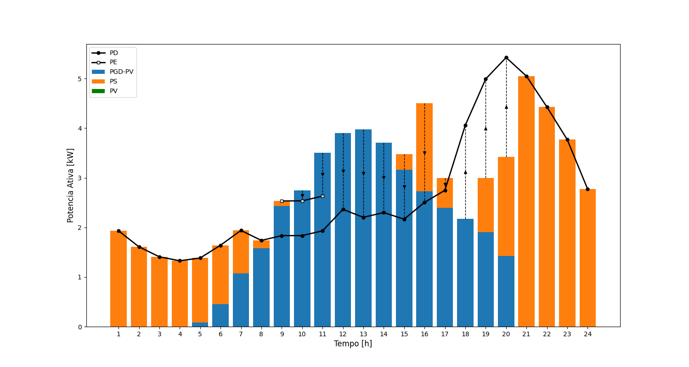

<h1>Optimization IT306 - 2023II</h1>

This repository contains the <b>Pyomo/Python</b> code files of the course (Original source <b>AMPL</b>):

 <i>"Applied Optimization in Electrical Energy Distributed Systems"</i>

- Student: Marck C. Llerena
- Prof: Marcos J. Rider

## Plots:

Plot para Aula_03, cap34.py

