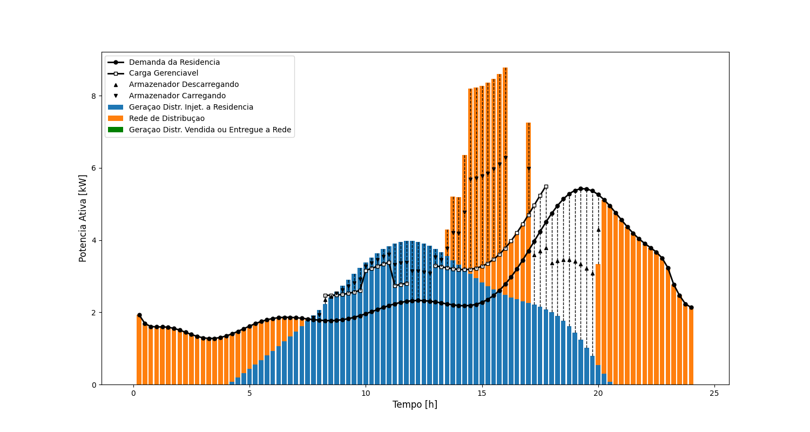

<h1>Optimization IT306 - 2023II</h1>

This repository contains the <b>Pyomo/Python</b> code files of the course (Original source <b>AMPL</b>):

 <i>"Applied Optimization in Electrical Energy Distributed Systems"</i>

- Student: Marck C. Llerena
- Prof: Marcos J. Rider

The code was formatted so the outputs obtained are similar to those obtained by the original AMPL code.
Since Python does not count with this formatting, the implementation was made using numpy, pandas & matplotlib.

## Plots:

Plot para Aula_03, cap34.py

Plot para Aula_03, geer.py

